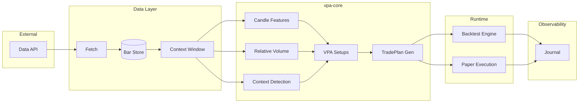
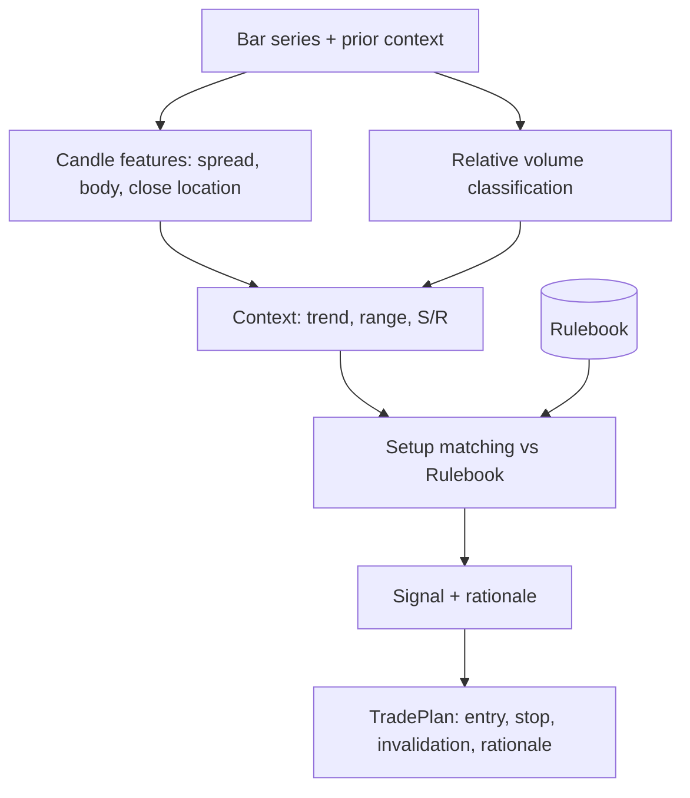

# vpa-engine — Architecture

Last updated: 2026-02-17

> **Canonical pipeline and system spec**: [`docs/vpa-ck/vpa_system_spec.md`](vpa-ck/vpa_system_spec.md) and [`docs/vpa-ck/vpa_signal_flow.md`](vpa-ck/vpa_signal_flow.md).  
> This file covers module boundaries and dependency rules. The canonical docs define the full  
> signal pipeline stages (Ingest → Resample → Features → Relative Measures → Structure → Context →  
> Rule Engine → Context Gates → Setup Composer → Risk → Execution → Journal).  
> If there is a conflict with the canonical docs, the canonical docs win.

This document covers the system structure, module boundaries, and dependency rules. See [PROJECT_CONTEXT.md](PROJECT_CONTEXT.md) for philosophy and intent. **Modular monolith first; microservice-ready later. Stocks-only MVP; paper trading first.**

---

## 1. Module map

| Module | Responsibility | I/O / side effects |
|--------|----------------|--------------------|
| **vpa_core** | Candle features, relative volume, context detection, VPA setup matching, TradePlan generation | **None** — pure library |
| **data** | Fetch OHLCV, normalize to UTC, persist bars, expose rolling context window for vpa-core | Network (data API), local storage |
| **backtest** | Replay bars in order, call vpa-core per bar, simulate fills/slippage/commissions, risk rules, metrics | Reads bar store, writes journal |
| **execution** | Paper only: TradePlan → orders, single-writer order/position state, risk checks, restart-safe persistence | Local state (file or SQLite) |
| **journal** | Persist signals, trades, invalidations with full rationale and rulebook reference | Append-only storage |

### Dependency rule

- **vpa_core** must have **no** dependencies on `data`, `backtest`, `execution`, or `journal`.
- All other modules may depend on **vpa_core** and on **journal** (as a sink).
- **execution** does **not** depend on **backtest** (separate use cases: backtest vs live paper).

### Single-writer execution rule

Execution MUST remain **single-writer**: only one process may write to a given execution state (e.g. one SQLite file per `PaperExecutor`). No concurrent writers to the same state path. This ensures restart-safety and avoids double orders or corrupted positions. See [RUNBOOK](RUNBOOK.md) for safe operation.

---

## 2. High-level data flow

---

## 3. vpa-core internal flow (deterministic)

All steps are pure functions: same inputs (bars + rulebook) always yield same outputs. No randomness inside core.

---

## 4. Boundaries for future microservices

The monolith is designed so that these boundaries can become service boundaries if scale demands it:

- **Data pipeline** — Can become a service that publishes “bar ready” or “context window” events. vpa-core would still consume the same bar/window contract.
- **Signal generation** — Could run in a worker that receives bars (or window snapshots), runs vpa-core, and publishes signals/TradePlans. Execution stays separate and single-writer.
- **Execution** — Stays a single, conservative component; scale only by symbol/account if ever needed, not by splitting into many writers.

**Contracts to define** (so they can later be RPC/events):

- Bar series / context window (input to vpa-core)
- Signal / TradePlan (output of vpa-core)
- Order / Fill / Position (execution layer)

See [DATA_MODEL.md](DATA_MODEL.md) for field-level contracts.
